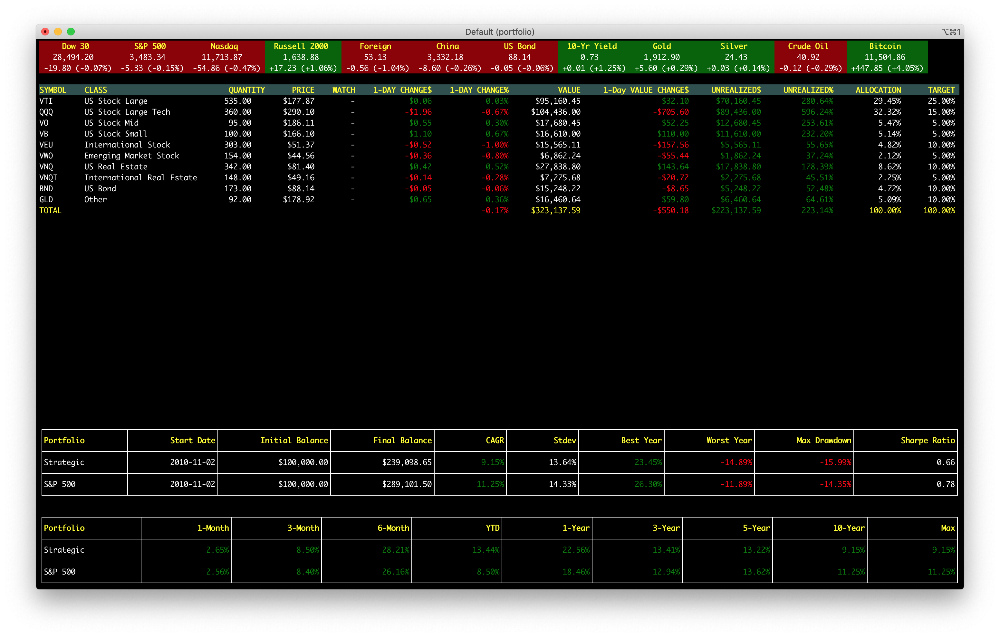
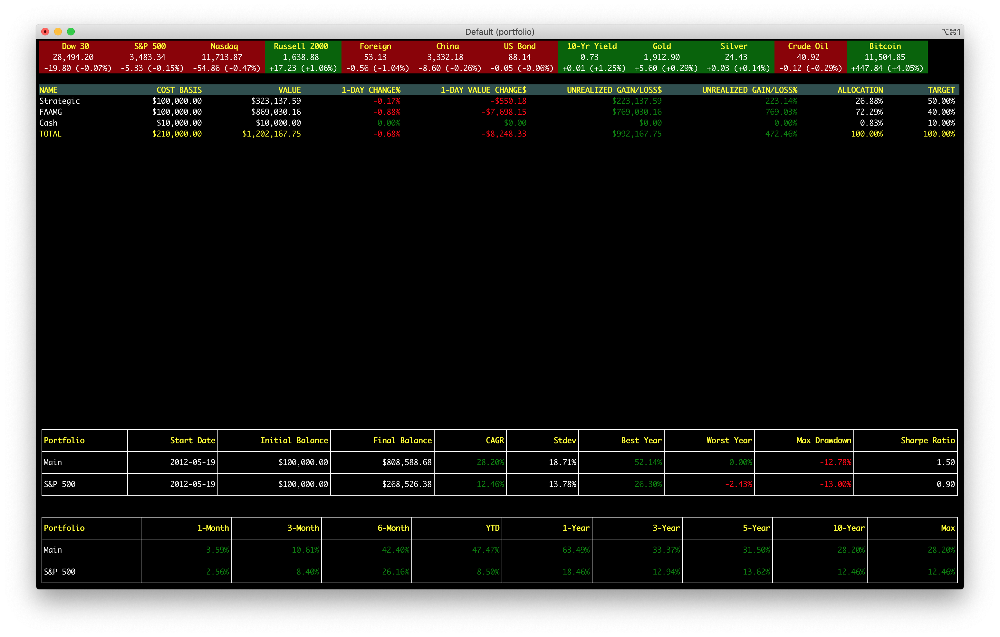

[](https://goreportcard.com/report/github.com/cimomo/portfolio-go)
[](http://godoc.org/github.com/cimomo/portfolio-go)
[](https://github.com/cimomo/portfolio-go/blob/master/LICENSE)

# portfolio-go: Portfolio Management for Geeks

A terminal based portfolio tracking, analysis and optimization tool implemented in Go. One screenshot is worth a thousand words:



## Using portfolio-go

Start the program by running:
```
portfolio --profile <path-to-profile>
```

Portfolios are described using a YAML file. Here is an example:
```
cash:
  value: 10000.00
  allocation: 10
portfolios:
- portfolio: FAAMG
  allocation: 90
  holdings:
  - symbol: FB
    quantity: 715
    allocation: 20
    basis: 20000
    watch: 230
  - symbol: AAPL
    quantity: 1172
    allocation: 20
    basis: 20000
    watch: 100
  - symbol: AMZN
    quantity: 78
    allocation: 20
    basis: 20000
    watch: 2800
  - symbol: MSFT
    quantity: 861
    allocation: 20
    basis: 20000
    watch: 200
  - symbol: GOOG
    quantity: 56
    allocation: 20
    basis: 20000
    watch: 1400
```
More examples can be found [here](examples/).

## Features

### Multi-Portfolio Support

Oftentimes, it is helpful to structure the overall portfolio into multiple sub-portfolios, possibly with different goals and strategies. Here is a sample configuration in the profile:

```
cash:
  value: 10000.00
  allocation: 10
portfolios:
- portfolio: Strategic
  allocation: 50
  holdings:
    ...
- portfolio: FAAMG
  allocation: 40
  holdings:
    ...
```

Notice that you may specify target allocations across different portfolios, as well as a cash allocation. When running Portfolio-go, press `m` or `0` to go to the profile homepage. Press `1` - `9` to switch between different portfolios. (This does mean that we support a maximum of 9 portfolios.)

Here is what the profile homepage may look like:



### Market Data

We track the major indices and markets, as well as key commodity prices. We view crypto currency as a viable asset class and track BTC and ETH in the market data section. Incidentally, the sample [portfolio](examples/profile.yml) for Strategic Asset Allocation includes a 5% allocation for BTC:

